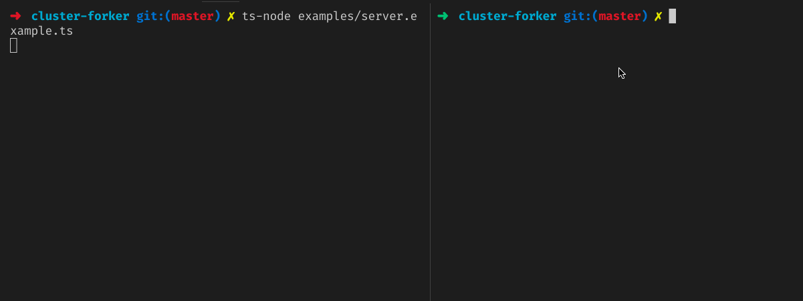

# cluster-forker

[](https://circleci.com/gh/nivrith/cluster-forker/tree/master)
[](https://www.npmjs.com/package/cluster-forker)
[](https://www.npmjs.com/package/cluster-forker)
[](https://github.com/nivrith/cluster-forker/blob/master/LICENSE)

easy node clustering

A single instance of Node.js runs in a single thread. To take advantage of multi-core systems, the user will sometimes want to launch a cluster of Node.js processes to handle the load.

The ClusterForker allows easy creation of child processes that all share server ports.

## Highlights

- Written in Typescript

- Wrapper for the `cluster` module

- Simple API

- Lazy, doesn't actually fork before the `run` method is called

- The worker processes are spawned using the child_process.fork() method, so that they can communicate with the parent via IPC and pass server handles back and forth.



## Installation

npm:

```shell
$ npm install cluster-forker
```

yarn:

```shell
$ yarn add cluster-forker
```

## Usage

> easy node clustering

```js
  //index.js
  const { Cluster } = require('cluster-forker');

  let superCluster = new Cluster();

  let superCluster = new Cluster();

  superCluster
  .master( ( cluster ) => {
    // This block runs only in master worker
    console.log('master is running');
  } )
  .fork( ( cluster ) => {
    http.createServer(function(req, res) {
      res.writeHead(200);
      res.end('process ' + process.pid + ' says hello!');
    }).listen(8000);
  } )
  .on('online', function(worker) {
    console.log('Worker ' + worker.process.pid + ' is online');
  })
  .limit( 4 )
  .forkOnExit((worker, code, signal) => {
    console.log('started new worker fork');
  })
  .onExit( ( worker, code, signal ) => {
    console.log('Worker ' + worker.process.pid + ' died with code: ' + code + ', and signal: ' + signal);
    console.log('Starting a new worker');
  } )
  .run() // Runs the cluster and begins forking

```

```shell

$ node index
> master is running
> Worker 31889 is online
> Worker 31890 is online
> Worker 31891 is online
> Worker 31892 is online

```


## License

MIT © [Nivrith](https://github.com/nivrith)
